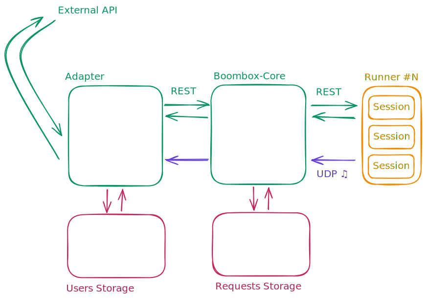

# Boombox - modular, open and easily customizable music player designed with respect for the ideas of clean architecture.
This repository contains examples of ready-made solutions for audio playback in various scenarios,
as well as general information about our infrastructure and the principles we follow in developing this project.

## Examples 
1. [Discord Audio Player](examples/discord-audio-player) - Host your own Discord audio player. 

## Scheme of work

